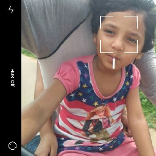

  
## Hi there! 👋  

### I’m Vinay Danepalli,  
a passionate developer on a journey to solve problems—simple or complex—and make an impact, big or small.  

  

<marquee behavior="scroll" direction="left" scrollamount="6" style="color: #555; font-weight: bold; font-size: 1.0em;">
🌌 Exploring the Cosmos of Ideas | 🌱 Growing Through Life, Relationships, and Challenges | 💡 Blending Curiosity with Purpose | ❤️ Building Meaningful Connections | 🚀 Creating Impact in the Infinite Universe of Possibilities | ✨ Striving for Growth, Empathy, and Innovation
</marquee>

# 
 🌐 **The Story So Far: Reflections on a Journey Unfinished** 

**Log Entry:** This is my personal chronicle—a living document of curiosity, growth, and the pursuit of impact. Each step, whether a success or a challenge, is a note in my ongoing story.

- **Mission:** To learn, solve, and create with purpose.
- **Status:** Always exploring, improving, and evolving.
- **Path Ahead:** Uncharted but fueled by curiosity and determination.

This log isn’t about destinations—it’s about the journey: the experiments, the lessons, and the small victories that build toward something greater.

Join me as I navigate this ever-evolving adventure, one step at a time. 🚀✨

  

## 
 🔍 Who Am I?
🌱 Continuous Learner: Always exploring new technologies and ideas to improve and grow.
🧩 Problem Solver: Tackling challenges with creativity and persistence.
🌐 Impact-Oriented: Whether it’s a tiny script or a scalable system, I aim to leave things better than I found them.
✨ Code Enthusiast: Crafting meaningful solutions that merge logic with elegance.

  

## 
 🌟 Curiosity Compass: Guiding Through My Journey 🌟

Welcome to the Curiosity Compass, a curated guide to my learning journey. Here, you’ll find:

✨ A Collection of Repositories
Each repository is a chapter in my story, chronicling my exploration of various skills, concepts, and technologies.

🧭 A Map of Growth
This master guide connects the dots across my diverse interests, showcasing the depth of my curiosity and the breadth of my learning.

💡 A Journey Through Tech
From foundational coding principles to advanced system design and problem-solving, this is a living testament to my dedication to continuous improvement.

🌐 Explore the paths I’ve traveled and join me on this ever-evolving adventure through the tech landscape! 🚀

-----

  

## 
 🚀 Core Technical Skills

### [🧮 Data Structures and Algorithms (DSA)](https://github.com/vdanepalli/vd_dsa/)
Dive into the foundations of efficient problem-solving with algorithms and data structures.
  - [📘 O'Reilly Graph Data Structure](https://github.com/vdanepalli/vd_dsa/blob/main/oreilly_graph_dsa/orielly_graph_dsa.md)
  Insights and exercises from the O'Reilly guide to mastering graph-based problems.
  - [🎯 ZTM Master Coding Interview](https://github.com/vdanepalli/vd_dsa/blob/main/ztm_master_ci/master_ci.md)
  Comprehensive notes and solutions for tackling interview challenges with confidence.

###  [🏗️ System Design](https://github.com/vdanepalli/vd_system_design)
Explore the art of building scalable, robust, and efficient systems.

  
  

## 
 🌟 A Heartfelt Thank You

Thank you for taking the time to explore my learning journey through this repository! ✨

Every note, link, and concept here represents a piece of the puzzle I’m assembling as I grow as a developer. It’s been a rewarding process of curiosity 🤔, persistence 💪, and more cups of coffee than I’d like to admit ☕.

I’m deeply grateful to the educators 📚 who light the way, the creators 🎨 who inspire fresh perspectives, and the tech communities 🌐 who show that learning is never a solo journey. You all make the path brighter, and for that, I’m endlessly thankful.

If you’d like to share feedback 📝, ask questions ❓, or even just say hi 👋, I’d be genuinely delighted to hear from you.

Let’s keep learning 🌱, building 💻, and lifting each other up as we go. The world is better when we grow together! 🌍

  

## 
 🗺️ Ways to Reach Me

#### 🐙 GitHub: [vdanepalli](https://github.com/vdanepalli/)
&nbsp;&nbsp;&nbsp;&nbsp;&nbsp; Check out my projects, explore my code, or leave a star ⭐ to brighten my day!

#### 💼 LinkedIn: [vdanepalli](https://www.linkedin.com/in/vdanepalli/)
&nbsp;&nbsp;&nbsp;&nbsp;&nbsp; Let’s connect and chat about tech, learning, or your favorite coding meme!

#### ✉️ Email: [vdanepalli@gmail.com](mailto:vdanepalli@gmail.com)
&nbsp;&nbsp;&nbsp;&nbsp;&nbsp; Feel free to drop a line—I promise I don’t bite! 📩
    
Feel free to reach out anytime! 🌍

  

## 
 🌀 The Journey Never Ends

Think of this space as a living, breathing work in progress — an evolving collection of ideas 🌱, experiments 🧪, and lessons 📘 from my learning journey. ✨

I’m always exploring 🔍, improving 🛠️, and adding new chapters 📖.

Stay tuned 🚀, because the most exciting chapters 🌟 are yet to be written! 🌐💡📚

  

----

📜 Disclaimer

This collection of repositories is a personal archive of notes created during my learning journey through various courses and resources. Some sections may include screenshots or excerpts to better understand and retain complex concepts. These materials are intended solely for personal reference and not for redistribution or commercial use.

If you are the owner or creator of any content featured here and would like it removed, please feel free to contact me, and I will address your request promptly. 🙏